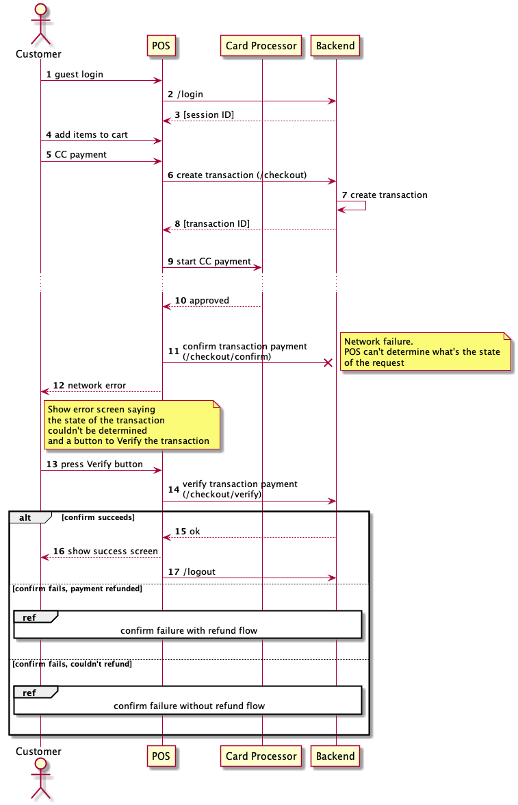

## CC checkout

## CC checkout confirm
We need changes on both backend and mobile side so that when a /confirm failure occurs, we know if payment has been refunded or not and act acordingly.

Current implementation doesn't distinguish the two cases and will restart the CC processing if the user retries. This might result in double payment if the payment wasn't refunded by the backend.

## CC confirm failure with refund

## CC confirm failure without refund
This case is not yet handled mobile side.

## CC chekout confirm network failure
For this scenario we need a /verify endpoint to check the transaction state.

Since the failure reason was a network issue, we shouldn't just call this directly and let the user decide. For that We'll show a screen saying the state of the transaction couldn't be determined and Verify|Cancel options.
When user cancels (network is down for istance), we should prompt to reach support.

## CC checkout flow interrupted
In some situations, the checkout flow can be interrupted. For instance the app crashes, or there is a network issue an we neve

This requires a backend side change to close open guest transactions on a new guest login.
A scheduled process could run to close any transactions are left open end of day.

